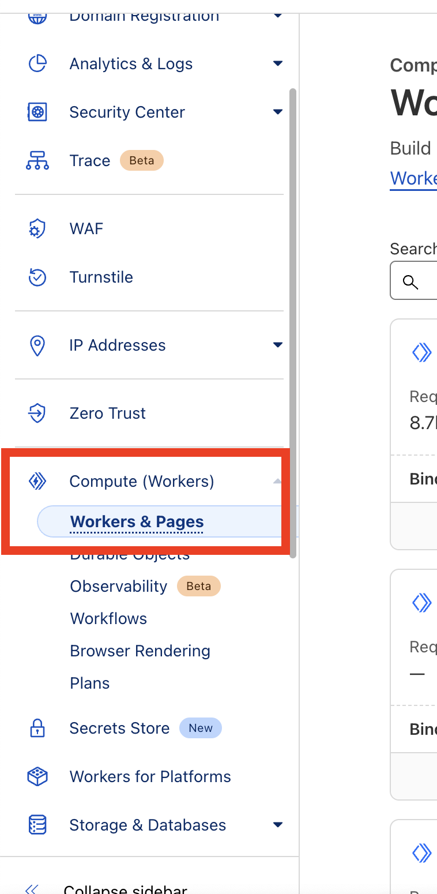
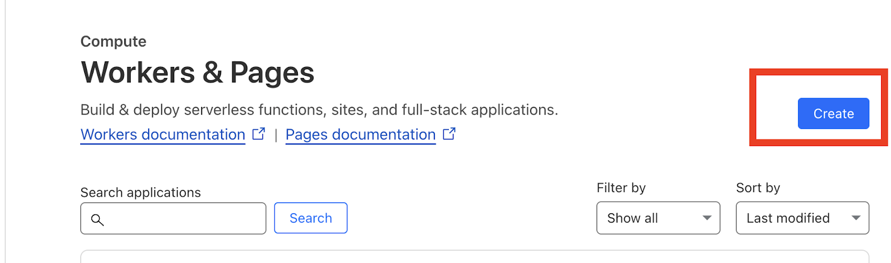
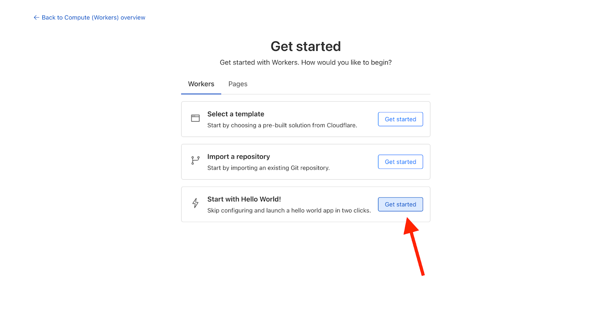
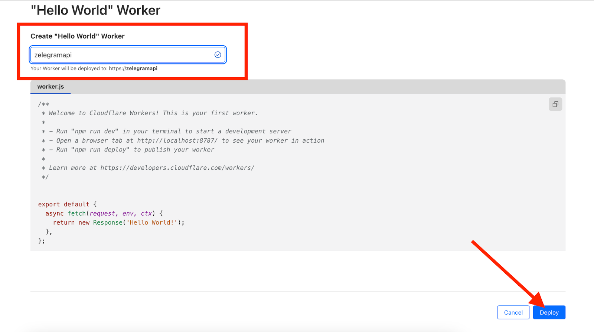
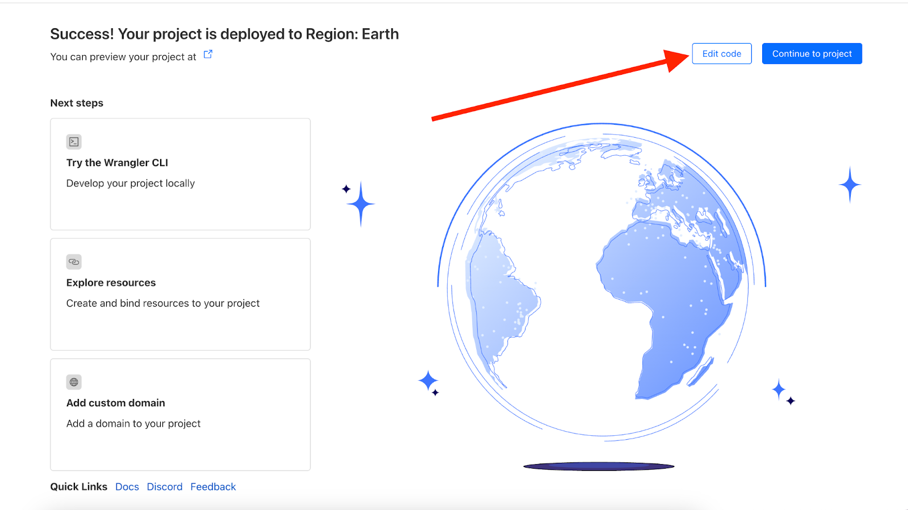
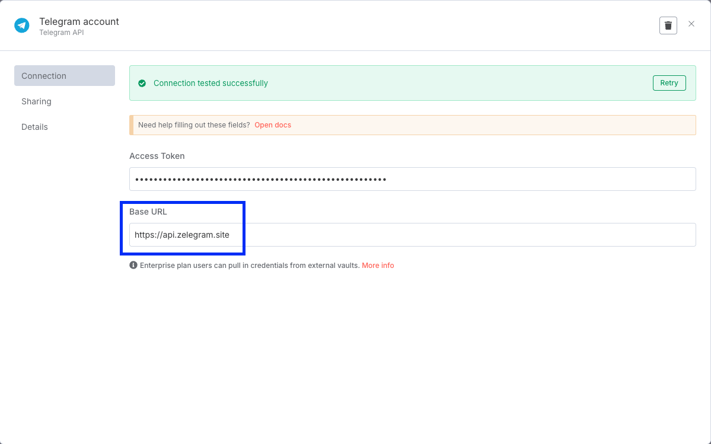

# api-zelegram-site
Cloudflare Worker for bidirectional forwarding between Telegram Bot API and your custom server.


## ✨ Features

- Bi-directional request forwarding
- Transparently proxies Telegram API requests
- Supports `setWebhook` and custom webhook forwarding
- Easily deployable on Cloudflare Workers
- Can be mapped to a custom domain

## 🌐 Example Use Cases

- Bypass restrictions when Telegram API is blocked
- Securely proxy bot API calls via your own domain
- Integrate with services that require fixed webhook URLs

## 🚀 Quick Deploy

### 1. Login or Sign Up on Cloudflare

Go to [https://dash.cloudflare.com](https://dash.cloudflare.com)

### 2. Go to **Workers & Pages** → **Create Application**


### 3. Create a new Worker


### 4. Choose "Hello World"



### 5. Click **Edit code**:


#### And replace everything with:
```js
export default {
  async fetch(request, env, ctx) {
    const url = new URL(request.url);
    const pathname = url.pathname;
    const searchParams = url.searchParams;

    if (pathname === "/" && request.method === "GET" && !url.search) {
      return Response.redirect("https://n8npremium.com/?ref=zelegram", 302);
    }

    const telegramPath = pathname + url.search;
    const telegramUrl = `https://api.telegram.org${telegramPath}`;

    const fileUrl = searchParams.get("files");
    if (fileUrl) {
      try {
        const decodedUrl = decodeURIComponent(fileUrl);
        const validatedUrl = new URL(decodedUrl);

        if (!["http:", "https:"].includes(validatedUrl.protocol)) {
          return new Response("Invalid protocol in URL", { status: 400 });
        }

        const imageResponse = await fetch(validatedUrl.href);
        if (!imageResponse.ok) {
          return new Response(`Failed to fetch image: ${imageResponse.status}`, {
            status: imageResponse.status,
          });
        }

        const headers = new Headers(imageResponse.headers);
        headers.set("Access-Control-Allow-Origin", "*");

        return new Response(imageResponse.body, {
          status: imageResponse.status,
          headers,
        });
      } catch (err) {
        return new Response(`Invalid photo URL: ${err.message}`, { status: 400 });
      }
    }

    let originalBody = null;
    if (!["GET", "HEAD"].includes(request.method)) {
      originalBody = await request.clone().text();
    }

    const webhooked = searchParams.get("webhooked");
    if (telegramPath.includes("webhooked") && webhooked) {
      try {
        const targetUrl = decodeURIComponent(webhooked);
        const validatedUrl = new URL(targetUrl);

        if (!["http:", "https:"].includes(validatedUrl.protocol)) {
          return new Response("Invalid protocol in webhooked URL", { status: 400 });
        }

        const forwardRequest = new Request(validatedUrl.href, {
          method: request.method,
          headers: request.headers,
          body: originalBody,
          redirect: "follow",
        });

        const response = await fetch(forwardRequest);
        return new Response(response.body, {
          status: response.status,
          statusText: response.statusText,
          headers: response.headers,
        });
      } catch (err) {
        return new Response(`Invalid webhooked URL: ${err.message}`, { status: 400 });
      }
    }

    let modifiedBody = null;

    const maybeParseBody = (body) => {
      try {
        return JSON.parse(body);
      } catch {
        return { raw: body };
      }
    };

    if (originalBody) {
      const parsedBody = maybeParseBody(originalBody);

      if (telegramPath.includes("setWebhook") && parsedBody.url) {        
        parsedBody.url = `${url.host}/webhook?webhooked=${encodeURIComponent(parsedBody.url)}`;
        modifiedBody = parsedBody;
      }

      if (telegramPath.includes("sendPhoto") && parsedBody.photo) {
        parsedBody.photo = `https://api.zelegram.site/?files=${encodeURIComponent(parsedBody.photo)}`;
        modifiedBody = parsedBody;
      }

      if (telegramPath.includes("sendVideo") && parsedBody.video) {
        parsedBody.video = `https://api.zelegram.site/?files=${encodeURIComponent(parsedBody.video)}`;
        modifiedBody = parsedBody;
      }

      if (telegramPath.includes("sendDocument") && parsedBody.document) {
        parsedBody.document = `https://api.zelegram.site/?files=${encodeURIComponent(parsedBody.document)}`;
        modifiedBody = parsedBody;
      }
    }

    const forwardRequest = new Request(telegramUrl, {
      method: request.method,
      headers: request.headers,
      body: modifiedBody ? JSON.stringify(modifiedBody) : originalBody,
      redirect: "follow",
    });

    const telegramResponse = await fetch(forwardRequest);
    return new Response(telegramResponse.body, {
      status: telegramResponse.status,
      statusText: telegramResponse.statusText,
      headers: telegramResponse.headers,
    });
  }
}

````

### 6. Click **Deploy**

### 7. Copy your deployed URL (e.g. `https://api.zelegram.site`) and use it in your Telegram bot's `setWebhook`.

### (Optional) Add a custom domain to the worker for production use.

## 🛡️ Disclaimer
This project is provided "as-is" without any warranty.

---

## 🧪 Try it live

Try it:
👉 **[https://api.zelegram.site](https://api.zelegram.site)**


---

## 🎓 Learn how to build automation with n8n + AI

- 💡 Muốn học cách xây dựng quy trình automation mạnh mẽ kết hợp **n8n + AI**?
- 👉 Tham gia ngay khoá học tại: [https://n8npremium.com](https://n8npremium.com)
- 🌱 Tự động hoá Zalo trong n8n, Tài nguyên miễn phí, bot mẫu, cộng đồng hỗ trợ: 👉 [https://linktr.ee/n8nzalo](https://linktr.ee/n8nzalo)
- 👉 Tự động hoá không còn là chuyện của developer — ai cũng có thể làm được!

---

